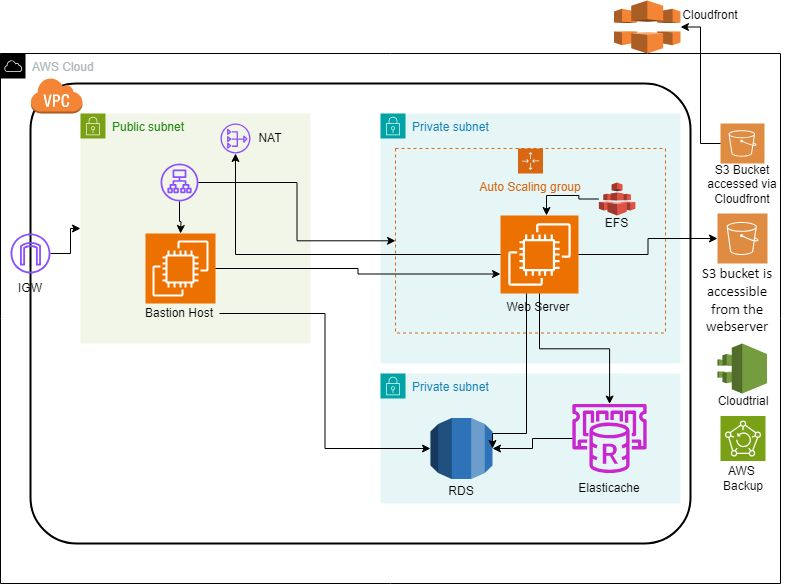

# 🏗️ AWS Secure & Scalable Infrastructure for Web Application

This project demonstrates a secure, scalable, and highly available AWS architecture designed for hosting modern web applications. It includes core AWS services like EC2, RDS, ElastiCache, EFS, S3, CloudFront, and IAM best practices.

---

## 📌 Key Components

### 🔹 VPC & Subnets
- Custom VPC with both **public** and **private subnets**
- **NAT Gateway** for internet access from private subnet resources
- **Internet Gateway (IGW)** for public access

### 🔹 Security & Access
- **Bastion Host** in the public subnet for secure SSH access
- **Private Subnet** resources only accessible via Bastion or ALB

### 🔹 Compute Layer
- **Auto Scaling Group** of EC2 instances running the web application
- **Elastic File System (EFS)** for shared storage across EC2s

### 🔹 Data Layer
- **Amazon RDS (MySQL/PostgreSQL)** in private subnet
- **Amazon ElastiCache (Redis)** for application-level caching

### 🔹 Object Storage & CDN
- **Amazon S3** for static asset hosting and application data
- **Amazon CloudFront** as CDN for secure, faster global delivery

### 🔹 Monitoring & Auditing
- **AWS CloudTrail** for API logging
- **AWS Backup** for centralized backup management

---

## ⚙️ Use Cases

- Hosting containerized or traditional web apps with shared storage
- High availability web architecture with strong security isolation
- Scalable backend APIs or microservices architectures

---

## ✅ Best Practices Followed

- 🔐 Private subnets for all critical components  
- 📈 Auto Scaling for compute layer  
- 🧹 Bastion Host for secure admin access  
- 🧾 Logging and audit via CloudTrail  
- 💾 Centralized backups using AWS Backup  
- 🚀 Global delivery via CloudFront CDN

---

